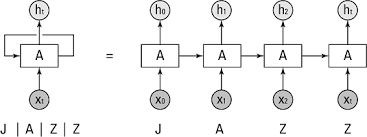
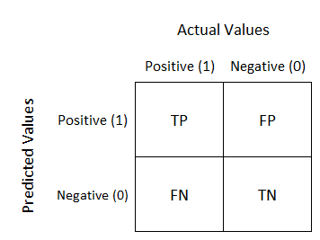

Name: Martijn Kok

Studentnumber: 18094627

Teachers: J. Vuurens &  R. Vermeij & T. Andrioli

Project: Wheels

# Portfolio
Individual portfolio of the contribution to the project, my abilities and what I have learned

## Introduction
My name is Martijn Kok and I am a fourth-year electrical engineering student that has done Applied Data Science as a minor. During de Applied Data Science minor I learned a lot about data and what can be achieved with just data. Through out the whole minor I have improved my abilities like Project Communication and Data Visualization, but I also learned a lot of new abilities like Predictive Models, Data preparation and Evaluation. This portfolio will be proof of what I have learned during this minor.

## Datacamp online course
The main coding language in this minor is python. To get familiar with this coding language I began an online coding tutorial named Datacamp. In Datacamp you have multiple courses with different goals. The main subject are: handling with pandas dataframes, preparing data, applying models and validating models. 

After finishing 100% of the assigned datacamp courses, I have learned a lot about machine learning and python. Through Datacamp I improved my knowledge about how to use python with large datasets and improve these datasets for machine learning. Furthermore, datacamp thought me what machine learning is and how you can implement different models like KNearestNeighbor, Linear Regression and DecisionTree with python. 
My process of Datacamp can be seen through this link: [Datacamp progress](Datacamp/Assignments-DataCampLearn.pdf), [Datacamp proof](Datacamp/MartijnKok_DataCampProfile_Overview.pdf)

## Research project

### Task definition
A lot of sportsmen use fitness trackers now a days to track their movements during all different kind of sports. A few examples of sports where trackers are used are rugby, athletics, and mountain biking. In these sports the fitness trackers help the sportsmen to improve insight on their performances. But all the available fitness trackers are specifically made for non-wheelchair athletes. These trackers can be used in wheelchair sports but won't give the wheelchair athlete a good picture of their performance because many fitness trackers are focussed on steps but as one wheelchair athlete mentioned "But, I don't take steps". Maybe machine learning in combination with IMU's can help wheelchair athletes get more insight in their performances. This is precisely where our project is focussed on. 

Our project is a little bit more specific; we want to recognize wheelchair basketball activities with machine learning through IMU recordings. Before planning what we were going to do during the project we researched a little bit. From this research we made a Plan of Approach, see [Plan of Approach](documents/Planofapproach.pdf). in this plan of approach, we mentioned a research question with a few sub questions:
* How can IMU data be used to identify wheelchair basketball-specific movements?
  * Which form of data processing will be used?
  * Which specific movements can be detected?
  * Which sensor data is used for each movement?
  * Can movements be used to predict fatigue?
  * Can movements be used to detect overload?
These sub question will help us to get an answer to the main research question.

### Evaluation
While working on the project we found out we didn't get enough time to finish all our sub questions. This resulted in that we changed our research question and our sub questions into:
* Can an RFC and a RNN be used to classify sprints in partially defined IMU recordings?
  * Which form of data processing will be used? 
  * Which sensor data is used to detect a sprint?

These questions were all clearly answered during our project in our research paper. But our results are just the beginning of what can be done with machine learning and IMU recordings. Right now, the machine learning model can recognize only one movement (Sprints), but the model can detect other movements like rotations and collisions. These movements all have clear patterns in the data. But before these movements can be detected the dataset needs to be expanded with more positive datapoint of rotations and collisions so that the machine learning model can be trained. When these movements are recognized there is the possibility to detect is the fatigue of a player by the decrease of the amount of sprints and the speed also, the overload of some players could be detected by the amount of sprints and turns they have done during a match. This can help trainers to see if a player needs te be replaced with a substitute. 

### Conclusions
During the project we have investigated, developed and applied a method to classify wheelchair basketball sprints through RNN and RFC models. This method is able to classify sprint form a partially defined IMU recording. This is done by expanding the partially defined dataset with more positives through comparing the results of different machine learning models. This will help to get a better ground truth in a dataset. In our project we could improve the dataset from 2.3% to 17.1% positive sprints in the dataset. This helped to train a effecient RFC model that was able to detect 90.4% of all tagged sprints with a precision of 89% in the train/valid dataset. To ensure the model also worked on a totally new dataset the model was fitted to a test set, this resulted in a precision of 91.67% and a unkown recall because the dataset was undefined. These results prove that it is possible to classify sprints in partially defined IMU recordings with a RFC and a RNN.
 

### Planning
During the whole project scrum (in Azure devops) see https://dev.azure.com/Wheeeeeeeeeeeeeeels/wheels/_boards/board/t/wheels%20Team/Stories_m_, was used to plan our project. Everyday at 9:30 the whole group had a stand-up meeting where we said what we did the day before and what we were going to do that day. This kept the whole team updated on what everybody was doing and how far everybody was with their part. Every 2 weeks the whole group did a retrospective and a planned the next sprint of two weeks. For the retrospective we discussed what we wanted to keep/remove/improve in our project, this helped us to improve how we worked in the project. During the sprint planning we made all user stories together and used scrum poker to determine how much work a specific user story was. This was done because the workload in the beginning project wasn't equally divided. For planning the internal and external presentations we tried to give everybody the same workload, so that everybody did at least 2 presentations.

## Predictive Analytics

### Selecting a Model

#### CNN
The wheels team got a large time series dataset of multiple gyroscope datapoints. I researched into models that would accept a time series as an input and that are used in classifying movements from humans with sensor data. After researching different models, I came across a 1D-Convolutional Neural Network used for human activity recognition through sensor data: https://www.sciencedirect.com/science/article/pii/S2666307421000140. In this research paper they also use gyroscope data to recognize movements, this was done with a 1D-CNN Model, a KNN, an SVM, etc. In this research paper the 1D-CNN significantly outperforms traditional approaches. This persuaded me to try a 1D-CNN model on my project.

#### RNN
When I researched for models that can be used on IMU (gyroscope data), I found an interesting research paper about detection specific motion from IMU data with LSTM (Long Short-Term Memory) and a RNN (Recurrent Neural Network), link: [Research Paper LSTM&RNN](Predictive_Models/sensors-21-01264-v2.pdf). This research paper showed a lot of potential. But I wasn't sure about it, so I researched more about which methods are already used to recognize activities. I found another paper that used LTSM RNN model for recognizing activities of humans through gyroscopes mounted on the wrist https://www.scitepress.org/Papers/2018/65852/65852.pdf. This showed an accuracy of 96.63% for detecting if a person was walking, idle, run, swinging or crouching. This whole paper had a lot in common with my project and showed great results with a LSTM RNN model, so I decided that I would give a RNN with LSTM a go to see if the results would be better then the CNN model. 

#### Conclusion
After researching the 1D-CNN and the RNN, I found out that both models are widely used in recognizing human activity with IMU data and show great results. This has a strong resembles with the classification I want to do for the project. Therefore, the models could also have great results on my dataset. To see which model would preform best, I made both models and compared the recall, precision and accuracy.

### Configuring a Model
#### CNN
After deciding that I would use a 1D-CNN model I needed to configure a model. This took a long time because there aren't that many 1D-CNN models online. After trail and error, I made a CNN model see link: [CNN](Predictive_Models/1D_CNN_Dataloader.ipynb). This model consists of a multiple convolution and linear layers. The CNN model is configured to receive tensors that were split into windows of 1 second with an overlap of 0.5 seconds, this was done so the results of could easily be compared to models used by other team members. For every 1 second window the model will decide if there is a sprint or not. The hyperparameters of this model (like learning rate and linear layer size) were tuned during the training of this model.

#### RNN
The RNN model is a basic RNN model with a hidden layer and a LSTM classifier. This model has the same input as the CNN model so most parts of the CNN code can be used for the RNN model, link: [RNN](Predictive_Models/RNN_Overlap_Dataloader.ipynb). The model was based on a RNN model that J. Vuurens showed during a lecture. The hyperparameters of this model (like learning rate and hidden layer size) were also tuned during the training of this model. This model is also configured to receive tensors that were split into windows of 1 second with an overlap of 0.5 seconds. This was done to make the RNN and CNN model mostly the same, so the data preparation steps aren't that different.

### Training a Model
After the two models were made I trained them with the main dataset of the project. I sliced the dataset into two parts, the train part and valid part. The train part was 75% of the data and the valid part was 25%. The first time I trained the model I set the epochs on 3000, of course this overfitted the model. To ensure there was no overfitting I visualized the accuracy, loss, recall and precision over the number of epochs, see: [CNN](Predictive_Models/1D_CNN_Dataloader.ipynb) and [RNN](Predictive_Models/RNN_Overlap_Dataloader.ipynb). After looking at the visualizations I saw that both models were overfitting and the learning rate and epochs of the models were too high. To fix the overfitting I used a data loader on both models also I played with the learning rate and the epochs. This data loader trained the model with a batch size of 64. For the CNN I also tuned the size and complexity of the convolutional layers and the linear layers. I tuned the RNN with different hidden layer sizes for the LSTM. For both model I played around and looked at the results for every change and finally tuned the model to achieve the highest recall with an acceptable precision.

### Evaluation a Model
After training the model the results needed to be evaluated. This was easier said then done, because the dataset that was provided by our problem owner wasn't completed. This meant the results of the models couldn't be evaluated on the normal way. To evaluate the models, I started with looking at the false positives of the models, this was done to check if the false positives are wrong or if the dataset was wrong. This was done with visualization code that I wrote: [False Positives Visualization](Data_Visualization/Check_False_Positives.ipynb). This code helped me and Daan to check the first false positives of the sprint code. After checking these false positives, we found almost 50% of the false positives were actually true positives. After adding these true positives to the dataset, I started to evaluate the CNN and RNN models, while other team members continued with checking the false positives. 

For the evaluation of the models the Recall was most important because this I knew was correct. For both models I made confusion matrixes of the results of the valid dataset. I used these confusion matrixes to compare the two neural networks. In the table below are the Recall/Precision and Accuracy score for the detection of a sprint.

*All Data*
| Models | Recall  | Precision  | Accuracy |
| :---:   | :-: | :-: | :-: |
| CNN | 0.84 | 0.75| 0.77 |
| RNN | 0.91 | 0.86| 0.90 |

*Just True Positives and False Positives*
| Models | Recall  | Precision  | Accuracy |
| :---:   | :-: | :-: | :-: |
| CNN | 0.97 | 0.51| 0.67 |
| RNN | 0.92 | 0.74| 0.82 |

From the tables above you can see the RNN model got the best results in 'All Data' for all the testing parameters. For the table with 'Just True Positives and False Positives' the CNN scored a better Recall but way worse accuracy and precision, from this information I choose to go further with the RNN model because the average score of the RNN fits better for our purpose then the CNN.

#### Evaluation of RFC model
My teammate Collin created a RFC model with great recall and accuracy scores on the valid set. To make sure that his model worked on other players, Collin an I used his RFC model on a dataset of a totally different player. The results of the RFC model on this dataset needed to be checked, because we had no tagged data for this player. To check the results I wrote a python script that visualized every 'sprint' that the RFC model tagged. I also printed the time when the tagged sprint happend in in the fitting video material see: [Check for test set](Predictive_Models/). Collin and I used this code to check the results of the RFC model. This resulted in a precision of 91.67% on the totally new dataset. The recall and accuracy of the model on this dataset couldn't be calculated because the sprint weren't tagged in this dataset. 

### Visualizing the outcome of the Model
The results of both models are visualized in the code by plotting the Accuracy and Loss of both the train and test set. Also, for both models the Recall and Precision for the test set is plotted, see [CNN](Predictive_Models/1D_CNN_Dataloader.ipynb) and [RNN](Predictive_Models/RNN_Overlap_Dataloader.ipynb). To visualize the results more for both models the confusion matrix was plotted. This showed clearly how the models were preforming. 

## Domain knowledge

### Introduction of the subject field
In the 21-century data has become one of the most valued items on the planet. The two biggest companies in the world (Google and Facebook) are masters in using data to make money. For many people data is just a list of numbers and you can only see what people have done. But in this minor (Applied Data Science) I learned that data is so much more then just numbers. Applied data science is about using data to predict what is going to be next and to recognize patterns in data and using data to improve insight in all attributes in your life. At the minor I started a project where I used machine learning to recognize activities from wheelchair basketball players. This project focussed on the use of IMU's to recognize activities from wheelchair basketball players. A few examples of such movements are: 'Fast Break', 'Fast Defence' and 'Collisions'.

### Literature research
Before I could begin with making machine learning models for my project I needed to research literature to know what already has been done for the problem my project faces. The first step was to understand what exactly the problem of my project was. My project was to use machine learning to recognize specific wheelchair basketball movements from IMU recordings. While researching I found a research paper that goes deeper into the problem of my project (https://dl.acm.org/doi/pdf/10.1145/2700648.2809845), this research paper explains the problems that wheelchair athletes have with tracking their activities in sports like basketball, rugby and tennis. This research paper made me understand the problem of my project better.

Now I knew what the exact problem is of my project, I wanted to know if there are any people that already tried to solve this problem. I found a few research papers that already tried to recognize specific movements like sitting and walking with the help of IMU recordings. But all these research papers were for people that weren't in a wheelchair, but the approach of these research could also be used for my project. A few examples of these research papers are: https://www.sciencedirect.com/science/article/pii/S2666307421000140, https://www.scitepress.org/Papers/2018/65852/65852.pdf, https://www.mdpi.com/1424-8220/21/4/1264/htm and http://www.ijpmbs.com/uploadfile/2017/1227/20171227050020234.pdf.

All above research papers showed me that different kinds of (NN) neural networks are commonly used to recognize activities from IMU data. But I had no idee how a neural network worked, to understand neural network I started to research how you can make a NN from scratch. While researching I found a great tutorial that showed me how you can make a NN and what everything meant https://curiousily.com/posts/build-your-first-neural-network-with-pytorch/. This tutorial helped me to make a basic NN and understand how it is made. But a basic NN neural network wasn't great for recognizing activities, most people used a 1D-CNN (Convolutional Neural Network) or RNN (Recurrent Neural Network) model. These NN networks were more complicated then a simple NN network. To understand how these models worked I researched into simple visualizations of these models https://towardsdatascience.com/understanding-1d-and-3d-convolution-neural-network-keras-9d8f76e29610, https://aditi-mittal.medium.com/understanding-rnn-and-lstm-f7cdf6dfc14e. This visualization helped me to understand how the models worked and know I could implement these models. For the 1D-CNN I researched a lot because there weren't many tutorials about how you can implement a 1D-CNN model with Pytorch, but I found a tutorial that helped me to make a basic 1D-CNN, https://wandb.ai/authors/ayusht/reports/Implementing-and-Tracking-the-Performance-of-a-CNN-in-Pytorch-An-Example--VmlldzoxNjEyMDU. For the RNN I used an example from a lecture that was given by Jeroen Vuurens

### Explanation of the Terminology, jargon and definitions
* **Datasets**, Before starting with something that look like machine learning you need to understand what a dataset is. A dataset is a file with data inside. An example is a file with the temperature of every day in the year. This file will have 2 features and 365 rows. The features are the day of the year and the temperature. 

* **IMU**, During my project there was a lot about IMU's (Inertial Measuring unit). A IMU is a sensor that can record accelerations in 3 Axis (XYZ), With these measurements you can see small movements. For my project there are a few more definitions that need to be explained:
  * **Fast Break**, A fast break is when a basketball player goes from defending to attacking in a short amount of time.
  * **Fast Defence**, When a basketball players is attacking and the counterparty captures the ball, the basketball player needs to go from attacking to defending in a short amount of time. This is a Fast defence.  

* **Classification/Regression**, In machine learning your have multiple kinds of machine learning. During this minor I mainly focussed on two kind of machine learning, Classification and Regression.
  * **Classification**, The first kind of machine learning is Classification, classification is a kind of machine learning that can classify data. For example, when you have 20   p   pictures of dogs and there are 4 different breeds, a classification model will be able to predict which of the 4 breed each dog is. A few examples of classification models are:
    * K-Nearest Neighbors    
    * Support Vector Machine
    * Decision Tree
  * **Regression**, When you don't just want to classify something, but you want to predict a specific value, you can use regression. A regression model can predict exact values, for example how much the sales of a company will be next year. A few examples of regression models are:
    * Lasso
    * Ridge

* **Pre processing**, You can't just get a dataset and directly make a machine learning model and expect that you get great results. To make sure your machine learning model gets the best chance, you need to pre-process your data. During this you can do a few things.
  * **Cleaning**, Many datasets have some missing data or data you don't want, for example when you have a dataset of the income of a shop for every day in the week, but the income of some days are missing and the shop is closed 2 days in the week. The missing data will have a NaN (Not a Number) value. When a machine learning model sees a NaN value it won't work. To fix this you can clean your data by replacing the NaN with the mean value of all the incomes. The data that you don't want like the 2 days in the week that the shop is closed you can remove. This is also part of cleaning your data. 
  * **Numeric**, Some datasets don't just have numbers but also have words, like the month of the year. A machine learning model will crash if it sees this. To fix this the nonnumeric numbers can be replaced, like the months of the year can be replaced with numbers from 1-12.
  * **Scaling**, When a dataset has multiple features but the range of one feature is 0-1 and the other feature is 0-100000 the model will not preform as good as when the features are scaled. Scaling of the features means that the range all features is made the same.
  * **Balancing**, Balancing is an important step in pre proccesing. Balancing is used by classification models. When a dataset has 300 values that classify as 1 and 50 values that classify as 0, the model will struggle with classifying the dataset correctly. This will happen because the model will get a preference to gamble that something 1 because the chance is higher that something is 1. To prevent this the dataset can be balanced, this means the amount of 1 value will be the same as 0.
  * **Outliers**, There are always outliers in a dataset. Outliers are values that aren't logical, for example when a dataset consist of the temperature of everyday in the year and one day it is 100 degrees Celsius. This is what we call an outlier. 
  
* **NN**, A totally different kind of machine learning is a Neural Network. A simple explanation of a NN is that a NN is a model works kind of like a human brain. The NN has nodes (synapses), these nodes have an input and an output. The node will get an input and will do a mathematical operation and sent that to the output. When you have multiple nodes you can let the NN do some hard mathematical functions and it will learn just a human learns. How to train a NN can be explained with a few definitions.
  * **Epochs**, when you have made a NN you need to train it just like a human need to learn. You can train a model with at dataset. The number of epochs you train a model over is the number of times the model will train with a dataset. For example, when you have 1 epoch, the model will see the dataset one time. But when you have 100 epochs the model will see the dataset 100 times. Just as a human, the NN will become smarter every time it sees the dataset.
  * **Learning rate**, for the NN you can set a Learning rate. The learning rate decides how much a NN will learn every epoch. When you set the learning rate low the NN will learn slow and needs many epochs to learn. When you set the learning rate high the model will learn fast every epoch but won't reach an optimum.
  * **Linear layers**, The number of nodes a NN has is determined by the linear layers. The linear layers of a model decide how complex the model will be. When you increase the number of linear layers the model will be able to detect more complex things but will take longer to train. When you lower the linear layers the model will train faster but won't be able to detect complex things.
  * **Overfitting**, When you train a NN you can increase the epochs of the model to a really big number so that the NN is as smart as possible. But when you do this you increase the chance that the NN will be overfitting. When a NN overfits it will precisely learn the dataset and will be able to predict everything if it is exactly as the dataset, but when the NN sees something different it won't know what to do. 
  * **Underfitting**, To prevent you can set the epoch low, but this will underfit the model. This means the model will never reach an optimum while learning. This can also happen when you set the learning rate to high.
  
* **Different kinds of NN**, There are many kinds of NN but during the minor we only spoke about two different models:
  * **CNN**, A CNN is a NN with a convolutional layer. This convolutional layer changes the input through a kernel. This kernel scans the data and outputs a modified shape of the input. This allows a NN to better identify patterns in for example images.
  * **RNN**, A RNN is a Recurrent Neural Network. This network will also take the previous data into consideration. A great example is seen this image.

  

* **Evaluation**, After you made your model you want to know if it work or not. This can be done by evaluation. There are a few things you need to know before you can evaluate a model:
  * **Evaluation models**, During the minor we mostly used two different kinds of evaluation methods:
    * **Cross Validation**, This evaluation method will split the dataset into two parts, a training and validation set. The training set is used to train the model. When the training is done the model is validated with the validation set.
    * **N-fold Cross Validation**, This evaluation method works the same as Cross Validation but for every experiment you do with the model the training and validation set are being mixed so that the training set and validation set are not the same as before.
  * **Loss**, Loss is very important if you want to validate a regression problem. The loss is how much the prediction differ from what it needed to be. The higher the loss the worse your model is. The loss can be calculated with multiple methods. The main methods are the RMSE (Root Mean Square Error), MSE (Mean Root error) and MAE (Mean Absolute Error). The RMSE is mostly used for linear data that doesn't have big outliers, when your dataset has outliers the MAE is better.
  * **Confusion Matrix**, When you evaluate a classification model you will get a confusion matrix. This matrix consist of the amount of correct and incorrect predictions. As seen in the image below. From this matrix a few things can be calculated:
    * Accuracy, The Accuracy is the amount of correct prediction divided by the number of incorrect predictions.
    * Precision, The Precision is TP/(FP+TP). This will show how precise the model is with predicting.
    * Recall, The Recall is TP/(TP+FN). This will show how many of the positives it detected.

  

## Data pre-processing 

### Data Exploration
Before I could start with coding I needed to understand the dataset I was going to work with. The dataset of the wheel project consists of sensor data of two IMU sensors on a wheelchair, one on the frame and one on the right wheel. This Sensor data was from a specific player that played a specific match. The action of this player were tagged in a separate file with the hand of video material. Before I could explore the data, the actions needed to be aligned with the sensor data. This was done by the whole project group. 

To understand this aligned data I have written a visualization code that will visualize all IMU sensors data for the tagged wheelchair basketball action like Fast Defences see [Detecting Patterns](Data_Visualization/Timestampfastdefence.ipynb). This visualization code helped me to understand the correlations between specific action like Fast Defence and the output of the IMU sensors. An example is that through the visualization code I saw the pattern of a fast defence, this fast defence consisted of a fast turn before a fast sprint. This was best seen with the wheelRotationalSpeedX and frameRotationalSpeedY of the IMU's. With this information I made a hypothesis that the variables wheelRotationalSpeedX and framRotationSpeedY would work the best to detect Fast defences.

After visualizing the dataset, the features that I found most suitable were used for the training of a K-Nearest Neighbour model to detect sprinting behaviour. When fitting the data to the model I ran into a problem. The model didn't have great results because the dataset wasn't balanced. The balance of the dataset was visualized to see how bad it was see: [Balancing](Predictive_Models/1D_CNN_Dataloader.ipynb). The dataset was more unbalanced than I thought, with this information I balanced the dataset. After balancing the dataset, the results of the model improved. The balancing of the dataset was done through oversampling of the positive results. This was done 2 times for the [CNN](Predictive_Models/1D_CNN_Dataloader.ipynb) and [RNN](Predictive_Models/RNN_Overlap_Dataloader.ipynb) model, because the balancing process of each model was a little different because of the input of each model was different.

### Data Cleansing
When the group received the dataset, the dataset needed to be cleaned. The dataset had two big problems; the first problem was that the dataset consisted of many NaN values. The second problem was that the dataset had a lot of unnecessary data, for example the match of a specific player had a duration of 45 minutes but the dataset of this player had data for over 60 minutes. 

To solve these two problems I wrote a simple program that would replace all the NaN in the dataset with the value 0. To fix the problem of unnecessary data I used a document were all the start and stop timestamps of the video were linked to the dataset. For example, the video started at the 1500 point of the dataset and ended at the 3500 point, the code would delete all the data before the 1500 point and everything after the 3500 point. The program that realized this is [Clean Data](Data_Preparation/Clean_Data.ipynb).

### Data Preparation

#### Transforming Dataset with math
To Transform the dataset a lowpass filter was fitted to the model. A lowpass filter was chosen because the IMU's had a sample frequency of 100Hz and some small movements like a turn of 0.1 degree would be seen by the IMU. For the project we only needed to look at the big movements like turning and sprinting. This meant the small movements didn't matter to us and could only affect our results. The lowpass filter deleted all the small movements and made the dataset smoother, this improved the results of our predictive models with a small percentage off +1% accuracy, +1% recall and +1% precision. After the lowpass filter a differential equation was fitted to the dataset. This was done to identify if a player is accelerating and could help the model with detecting sprints. This was done through a differential equation of the wheelRotatationSpeedX. This resulted in the acceleration of the wheel. The code that I wrote for the differential equation and lowpass filter can be seen in: [Random Forrest Classifier](Predictive_Models/RandomForrestCLassifier.ipynb). The differential of the wheel speed resulted in an increase of 1% accuracy, 3.5% recall and 4% precision.

#### Transforming Dataset through comparison of false positives
A big problem during the project was that the received dataset didn't have all true positives tagged. Therefore, when a model is going to classify movements there will be many false positives. To expand the dataset, me and Collin wrote code that will help with expanding the dataset. The goal of the code is to compare the timestamps of false negatives of two machine learning models to conclude if a false positive is actually false or true. If both models predicted a false positive on the same timestamps Collin and I assumed that that the models were right and added a sprint to the dataset at this specific timestamp see [Comparison of FP](Data_Preparation/Compare_Results_Models.ipynb). This technique improved the dataset from 2.4% to 17.1% sprints in the dataset

### Data explanation
The sensor dataset consisted of 2 IMU sensors with 3 Axis (XYZ), this resulted into a total of 6 features in the dataset. The dataset was expanded with a few processed features like frameRotation, a timeLine and frameAngle. In total the sensor dataset consisted of 16 features that could be used for detection specific actions. All features had a sample frequency of 100Hz, this meant that for every second there were 100 datapoint for each feature. 

The Action that correspondent with sensor dataset were tagged by a human using video material. These action and their timestamps were noted in a separate dataset. These two datasets needed to be combined before it can be used for machine learning. 

### Data visualization
Before I could start with training predictive models in needed to understand the data. To understand this data I have written a visualization code that will visualize all IMU sensors for wheelchair basketball action in the dataset like a fast defence, see [Detecting Patterns](Data_Visualization/Timestampfastdefence.ipynb). This visualization code helped me understand the importance of visualization/understanding your data before you can train a model. Through the visualization the best features for the model can be chosen, like the wheel speed of the wheelchair and the frame rotation speed. 

Throughout the whole data preparation, training, tuning and validating of the predictive model’s data visualization was used. An example is the visualization of the balance of the data as seen at data preparation. Furthermore, visualization was used when creating the CNN and RNN models as seen in training and validating the models.

## Communication

### Presentations

#### Internal/External 
During the minor I have given multiple internal/external presentations. These presentations showed the progress of my project group during the minor and what we were going to do in the next scrum sprint. Also giving the presentations gave me an opportunity to improve my English presentations skills and ask question to the class about problems I got with my project, for example about which models would accept timeseries data from IMU sensors. The links to the presentations are: [Internal 06-11](Presentations/Wheels_06-11.pdf), [Internal 24-10](Presentations/Project_Wheels_24-10.pdf), [External 10-12](Presentations/ExternalWheels-9-12.pdf).

#### Learning Lab
I gave a learning lab during the minor about data preparation for Sensor’s data, see: [Learning Lab](Presentations/LearningLab.pdf). This Learning lab was focussed on teaching the class the importance of data preparation. During the Learning lab I also gave the class a challenge to win a beer, sadly only one person submitted a jupyter notebook. The challenge was to improve the results of a dataset with just data preparation see: [Challenge](Presentations/LearningLab.ipynb).

### Writing Paper
For the research paper I have written particularise parts like the part about recurrent neural networks, validation, and results, see [Research paper](documents/Research_Paper_Project_Wheels_V1.pdf). Also, I helped a team member with question about the content of the research paper for example information about validation and data preparation. Furthermore, I worked together with my whole team to improve the paper by peer reviewing each others work multiple times. I was also responsible for the layout of the whole paper; this included the references to images and literature. 

## Reflection and evaluation

### Reflection on own contribution on the project
*STARR*
| | |
| :---:   | :-: |
| Situation | During the minor I was part of the Wheels project group. This project was about how you can use IMU data to classify specific wheelchair basketball movements. |
| Task | During the project I wanted to make a good contribution to my project team and didn't want to lack in work ethic. Furthermore, I wanted to learn about Applied Data Science and wanted to share my knowledge about specific subjects I learned from school to the rest of my project team. |
| Action | In the project I started with learning the basics of machine learning through an online programming course named Datacamp. When this was finished I began with focussing on what the possibilities were with the given dataset and started with writing code to improve the given dataset. When this was done is started to dive into predictive models like neural networks through research and trial and error, to understand how it all worked and how I could be implemented into my project. In between all of this I gave internal and external presentations to the class and external people|
| Results | I finished the online programming course Datacamp and wrote code that worked well to fix a few issues that we had with the dataset like cleaning and finding more ground truths. After that I finished multiple Neural Network models like a 1D Convolution Neural Network and a Recurrent Neural Network with LSTM that were heavily used during the project. In these models and models of my teammates I implemented many features that helped me and my teammates to have better results on our models, a few examples are data loaders, data cleaners and validation programs. I also helped my teammates with coding their parts so that they wouldn’t be stuck on problems. Furthermore, I wrote parts of the Research paper that I knew most off and kept the whole class updated on my project through internal and external presentations. Also, I gave a learning lab to the whole class about the importance of data preparation of sensor data and how you could implement it. |
| Reflection| My coding contribution to this project was good. I did a lot of the coding for my project and helped my teammates with coding when it was needed. For the research paper I had a good but not excellent contribution, I wrote what in needed to write and I reviewed everybody’s work but I did just as much work as my teammates. I gave a lot of presentations during the project, and I kept the class updated about my project, I also gave a learning lab about data preparation for sensor data. This was a great contribution to the project, the whole class and my own learning experience.|

### Reflection on own learning objectives
*STARR*
| | |
| :---:   | :-: |
| Situation | I started with the Minor Applied Data Science to learn more about the use of machine learning models and how you can use data. |
| Task | During the minor I wanted to expand my knowledge about machine learning and learn about the possibilities you have with data. Also, I wanted to work with student from different educational backgrounds then me to find out how much they know about coding and learn from the knowledge they have.  |
| Action | In the minor I started with a project that had four people with different educational background then me. In this project I worked with the scrum method to plan the whole project. During this project I also worked with many machines learning models and with different datasets. I also followed every lecture the teachers gave about machine learning and other subject like data visualization and research during the minor. |
| Results |  The thing I learned could be split into two parts, applied data science and teamwork. In the minor I learned a lot about applied data science and what the possibilities are of data. I also learned how you can implement different models like KNearestNeighbour, 1D-CNN and RNN. For these models I learned how you can tune models and what is important to do before you start working with big datasets like cleaning/preparing your data and understanding your data. For the teamwork aspect of this minor, I learned how you can work together with people with different educational background then you and have a better end result because of it. I also used a planning method I would never use on my own and learned how you can organize a project through scrum.|
| Reflection| I learned a lot from the whole minor and my project, it was a great learning experience. I have learned a lot about applied data science and what is means to be a data scientist. It was fun to work with data and see what you can do with is, but it’s not something I want to continue with in my career because I miss making something physicals and don’t want to sit behind a computer all day. For the teamwork I maybe learned the most during this minor. I was great to work with people with different educational backgrounds then me because they have different views on specific problems. The way different kind of people work together and how you can use everybody’s talent for specific tasks was interesting for me. |

### Evaluation on the group project as a whole
*STARR*
| | |
| :---:   | :-: |
| Situation |  In the minor I worked together with 4 other persons to make a machine learning script that can analyse IMU data and classify specific wheelchair basketball movements with it. |
| Task | The goal of the project was to work together to research and make a machine learning model that will classify specific wheelchair basketball movements. This was done for the Dutch female Paralympic team. For this project I needed to work close with my team and use everybody’s strong point to achieve a great and result |
| Action |  In the project me and my team started with exploring our project and what we needed to do. With the knowledge about this project, we wrote a plan of approach for us and our problem owner. To organize our project, we used the scrum method, this included a stand up every morning at 9:30 and a retrospective every two weeks to see what we can improve in the project. After the plan of approach, we started to work in duos to try machine learning and to explore our data. When we knew more about machine learning and our data we started to work on our final machine learning model that would detect sprint in IMU data. Our findings of our dataset and machine learning models were documented into a research paper and a personal portfolio.|
| Results | The first result of our project was our plan of approach, this helped us to tell our problem owner and ourselves what we were going to do during the project. During the whole project scrum helped us with knowing what everybody was doing, and this gave us the opportunity to intervene if somebody was doing something wrong. With the retrospective we have really improved the workplace and the motivation of every project member.  We as a project group made two predictive models that can detect sprints out of IMU data. We also made a program that uses the two predictive models to compare results and improve our dataset. We documented this all in a research paper.|
| Reflection| We as a project group worked great together and everybody of my project group wanted to help each other and would always make time for each other. This resulted in a good working environment and motivated me to work harder. The scrum method also helped me to know what everybody in my team was doing. But we also had some problems in the group, in the first 10 weeks we had an extra team member that wasn’t doing much. We tried multiple ways to get him to worked but with no success. This resulted that the person quitted the minor because he didn’t do much. The remaining person in the project had only one problem. That problem was we had two person that were quite dominant in what the wanted, it was hard to change their mind (me included). But this was solved by great communication form the other member of the project group. In general, this project group was one of the best groups I had during a project, because of the diversity of everybody’s talents. |

